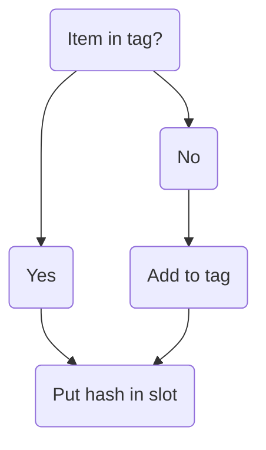
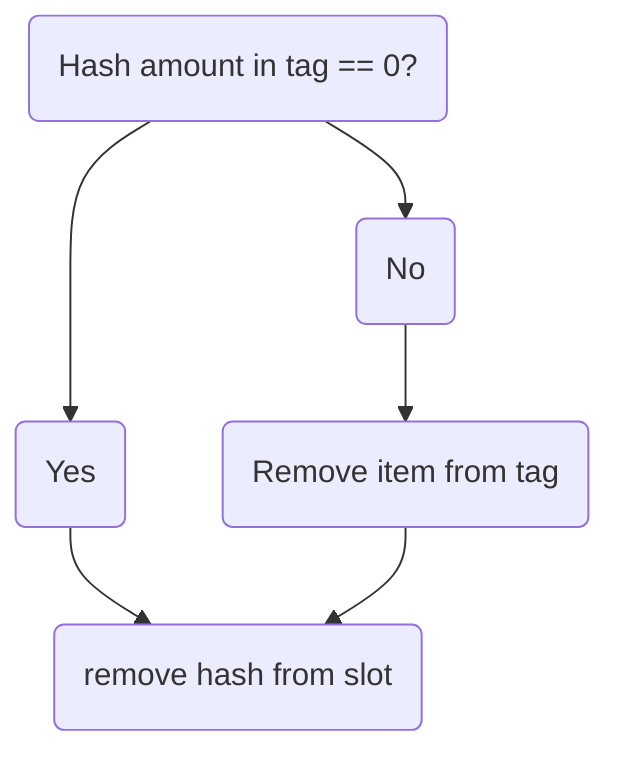

Each tab stores items using block data

Players can open different tabs in same grid. Sync happens thru block data

Store block data as CompoundTag:

Item_name, hash, amount in grid

Have tab matrices store hash values instead of items+components

On insert:

On take:

When sending update, only send tag changes and changed slots for smaller packets

ContainerMenu listens for data update and tells client.

## Multiple people interact

Ask to take from slot. Server confirms you can and updates CompoundTag

## Which grid is shown

Players can switch matrices independently. Last person to exit grid sets active matrix which will open next time

Right-clicking on the switching button pins that matrix to open when grid is opened
