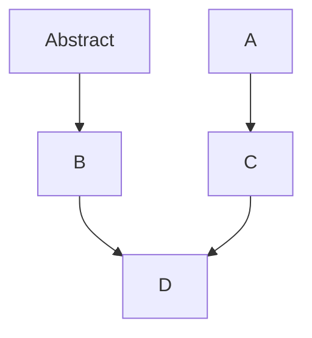

## Definitions

Grid: the block entity

Workstations: different types of crafting blocks. Crafting table, smithing table, stonecutter

Matrix: the slots/view associated with a workstation

[AbstractCraftingMatrix.java](../../../refinedstorage-common/src/main/java/com/refinedmods/refinedstorage/common/grid/workstations/AbstractCraftingMatrix.java)
[CraftingCraftingMatrix.java](../../../refinedstorage-common/src/main/java/com/refinedmods/refinedstorage/common/grid/workstations/CraftingCraftingMatrix.java)
[CraftingMatrix.java](../../../refinedstorage-common/src/main/java/com/refinedmods/refinedstorage/common/grid/workstations/CraftingMatrix.java)
[CraftingSmithingMatrix.java](../../../refinedstorage-common/src/main/java/com/refinedmods/refinedstorage/common/grid/workstations/CraftingSmithingMatrix.java)
[SmithingMatrix.java](../../../refinedstorage-common/src/main/java/com/refinedmods/refinedstorage/common/grid/workstations/SmithingMatrix.java)
[WorkstationRecipeContainer.java](../../../refinedstorage-common/src/main/java/com/refinedmods/refinedstorage/common/grid/workstations/WorkstationRecipeContainer.java)
[WorkstationRegistryImpl.java](../../../refinedstorage-common/src/main/java/com/refinedmods/refinedstorage/common/grid/workstations/WorkstationRegistryImpl.java)

